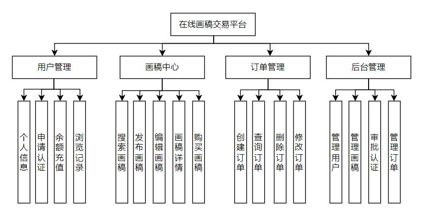

# 在线画稿交易平台

## 项目介绍

在线画稿交易平台是一个专用于画稿作品的电商交易网站

后端地址：https://github.com/Chaim16/draft    
前端地址：https://github.com/Chaim16/draft-web

## 主要功能

1. 用户管理：登录/注册，个人中心
2. 设计师审核：用户向平台申请，管理员审核之后成为设计师，才能上传画稿售卖
3. 余额充值：对接第三方支付宝进行余额充值
4. 画稿上传：设计师可以上传自己的作品，并设置价格、描述、分类等
5. 画稿搜索：用户可以根据关键词、分类等进行画稿搜索
6. 购买画稿：用户可以购买设计师上传的画稿

## 角色划分

- 普通用户：可浏览画稿、搜索画稿、购买画稿，申请成为设计师
- 设计师：可以上传、编辑和管理自己的画稿
- 管理员：负责审核设计师申请、画稿审核、交易管理等

## 技术栈

前端

- Vue.js: 3.2.13
- Ant Design Vue: 4.2.6
- axios: 1.7.9
- vuex: 4.0.0
- 开发环境：Node 18.16.0

后端

- Python: 3.11.11
- Django: 4.2.0
- Django Rest Framework：3.14.0
- Django Rest framework simple JWT：5.4.0
- Swagger: 1.21.8
- MySQL：8

## 界面

注册界面

登录界面

余额充值界面

申请成为设计师界面

购买画稿界面

管理员操作退款界面

## 总体架构

## 数据库设计-ER图

